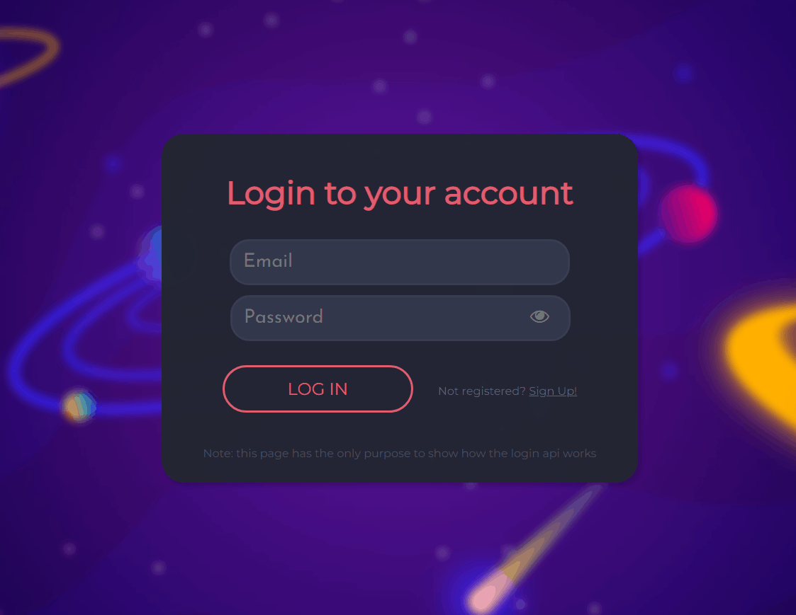
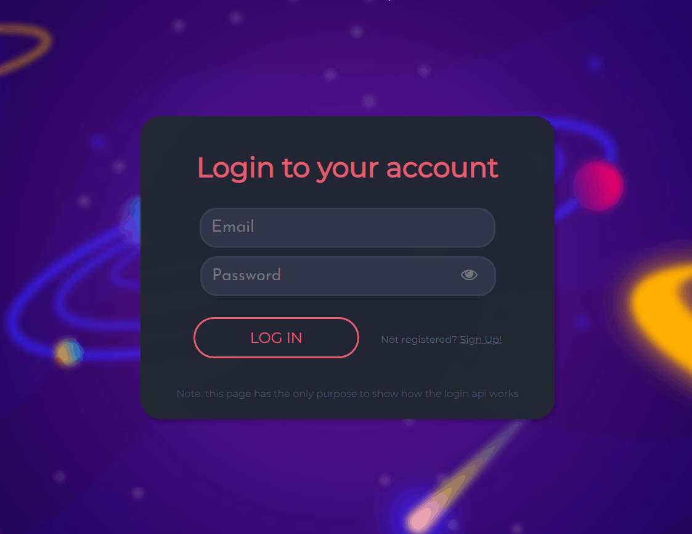

<h1 align="center">Login JWT</h1>
<div align="center">
    
    
    
    <a href="https://twitter.com/luisf_csdev/status/1594989881939345409" target="_blank" rel="noreferrer noopener">
        
    </a>
</div>
<p align="center">➡️ Login API that allows you to sign up, log in and see your data 🚪</p>

<h4 align="center">
    <a href="#-features">Features</a> •
    <a href="#try-it-yourself">App Demo</a> •
    <a href="#-prerequisites">Prerequisites</a> •
    <a href="#-clone-repository">Clone Repository</a> •
    <a href="#-stacks">Stacks</a> •
    <a href="#excelsior-code--by-luís-felipe">Author</a>
</h4>
<br>

## 📌 Features
- [x] Reusable login API 
- [x] Prefetch pages on hover links 
- [x] Success and handled errors messages
- [x] Unique emails register
- [x] Confirm password on sign up
- [x] Reveal/hide password
- [x] Encrypted passwords with bcrypt
- [x] Users searched on the database
- [x] Token saved in local storage until sign out
- [x] Credentials only showed when a user is logged
<br>

## [🚪TRY IT YOURSELF🚪](https://chat-rooms-socket.netlify.app/)
<div align="center">
    
    
</div>

## 
<br>

## 💾 Prerequisites
You'll need to have the following tools installed on your machine:
- [GIT](https://git-scm.com/)
- [Node.js](https://nodejs.org/)

Also, use your preferred code editor.
<br>

## 🪢 Clone Repository
```bash
# execute the git clone command
git clone https://github.com/luisf-csdev/login-jwt.git

# enter the project folder
cd login-jwt

# install the dependencies
npm install

# run the dev script
npm run dev

# the app will start in port:3000 - access <http://localhost:3000>
```
<br>

## 💽 Stacks
<span>
    
        <a href='https://reactjs.org/'>React</a>
    
        <a href='https://nodejs.org/'>Node.js</a>
    
        <a href='https://nextjs.org/'>Next.js</a>
    
    <a href='https://www.mongodb.com/'>MongoDB</a>
     
        <a href='https://jwt.io/'>JSON Web Tokens</a>
    
</span><br><br><br>

<hr>
<div align="center">
<h4>Excelsior code 💙 by Luís Felipe</h4>
 
[🪐 See my LinkedIn 🪐](https://www.linkedin.com/in/luisf-csdev/)
</div>
